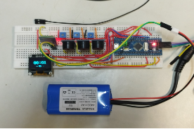
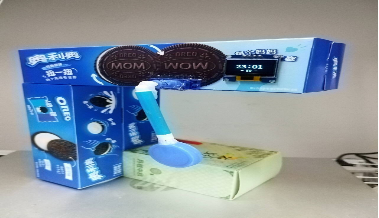
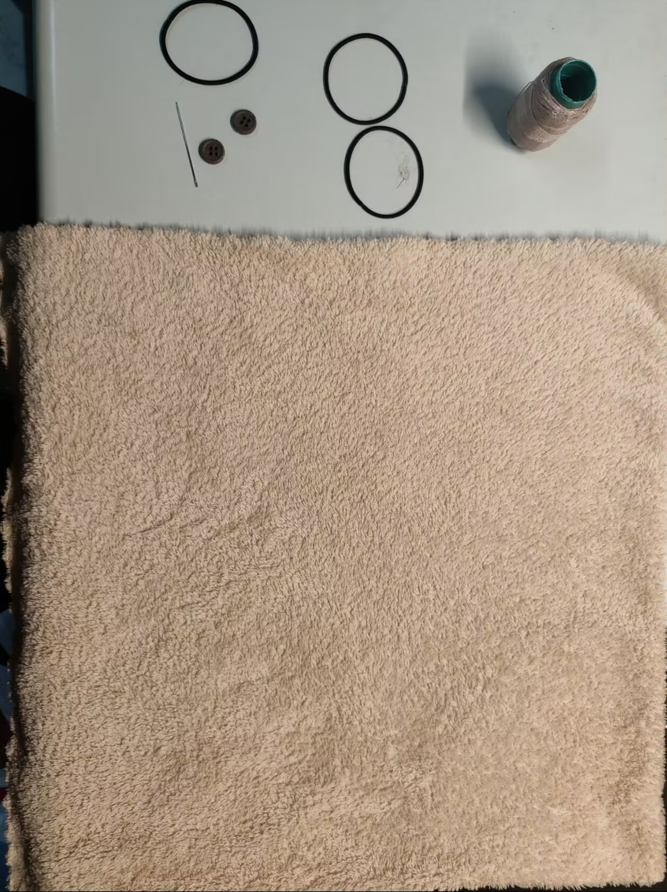
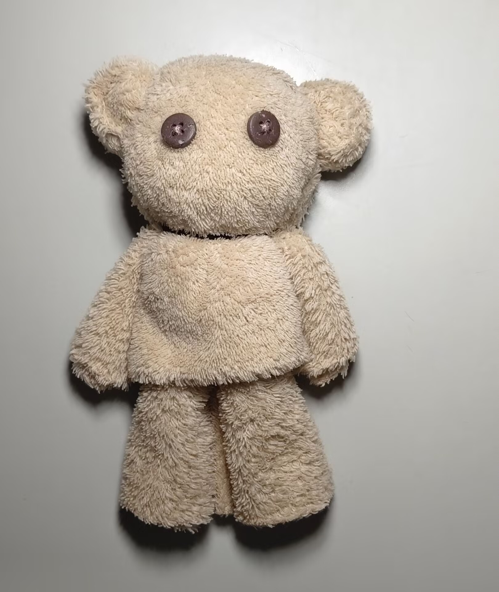

蓝牙音乐小摆钟：内置3个蜂鸣器，可以同时播放3个旋律，用交响乐给生活伴奏；舵机制成的迷你钟摆，随情景自动改变摆动频率，用智慧给桌面添彩。利用蓝牙模块实现无线命令行交互功能；利用I2C协议的OLED液晶屏显示美观的界面。摆钟、秒表、闹钟、定时器、日历、音乐播放器、钢琴模拟器等功能集于一身。

材料：32单片机，奥利奥盒，抽纸盒，矿泉水瓶等。

---

毛巾小熊凭借其可爱的造型、柔软的触感和实用的材质，可以当作桌面摆件，放置于书桌、梳妆台或电视柜，增添温馨治愈感。

材料：毛巾，针线，皮筋，纽扣等。

---

---
